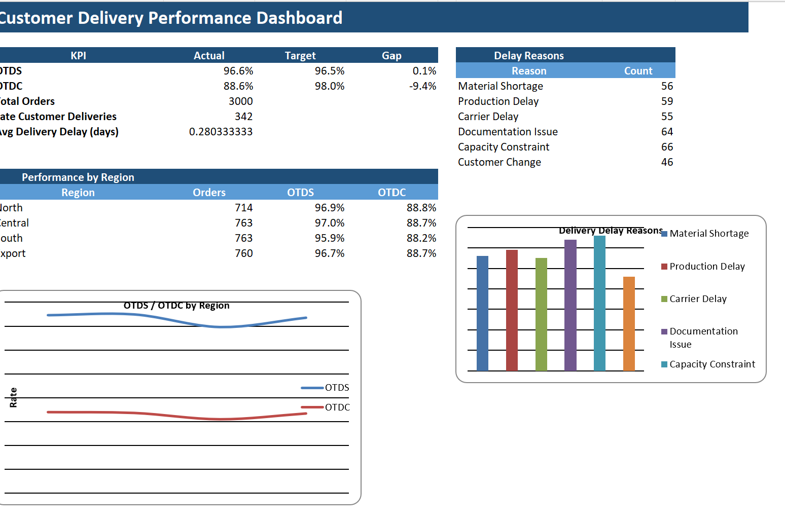

# 📦 Customer Delivery Performance & OTDS/OTDC Dashboard

> Portfolio project simulating a Supply Chain delivery-reporting environment — tracking On-Time Delivery to Schedule (OTDS) and On-Time Delivery to Customer (OTDC) performance, root causes of service failures, and exception follow-up.

  
  
  
  

---

## 📌 Table of Contents

- [Objective](#-objective)
- [Business Questions](#-business-questions)
- [Dataset](#-dataset)
- [KPI Definitions](#-kpi-definitions-used-in-this-simulation)
- [Dashboard KPIs](#-dashboard-kpis)
- [Key Findings](#-key-findings)
- [Exception Report](#-exception-report)
- [Recommended Power BI Pages](#-recommended-power-bi-pages)
- [Tools & Techniques](#-tools--techniques)
- [Files](#-files)
- [Disclaimer](#-disclaimer)

---

## 🎯 Objective

Portfolio project aligned to a Supply Chain internship focused on customer-delivery reporting, daily operational reporting, and on-time performance monitoring — covering both shipment-side (OTDS) and customer-side (OTDC) service levels.

---

## ❓ Business Questions

1. Are shipments meeting the OTDS target of **96.5%**?
2. Are customer deliveries meeting the OTDC target of **98%**?
3. Which regions, products, and delay reasons drive service failures?
4. Which late orders require planner follow-up?

---

## 🗂 Dataset

A synthetic order-level dataset of **3,000 orders**, each containing:

| Field | Description |
|---|---|
| Order_ID, Customer, Product, Plant, Region | Order identification and dimensions |
| Order_Date | Date the order was placed |
| Requested_Delivery_Date | Customer-requested delivery date |
| Scheduled_Ship_Date | Planned ship-out date |
| Actual_Ship_Date | Actual ship-out date |
| Actual_Delivery_Date | Actual delivery date |
| Quantity, Shipping_Mode | Order volume and transport mode (Road / Sea / Air) |
| Delay_Reason | Root cause when a delay occurs |
| OTDS_Flag, OTDC_Flag | On-time flags derived from schedule/actual dates |
| Ship_Delay_Days, Delivery_Delay_Days | Delay magnitude in days |
| Exception_Status | On Track / Ship Late / Customer Delivery Late |

---

## 📐 KPI Definitions Used in This Simulation

- **OTDS** = orders where `Actual Ship Date <= Scheduled Ship Date` ÷ total orders
- **OTDC** = orders where `Actual Delivery Date <= Requested Delivery Date` ÷ total orders

> These definitions are a portfolio simulation and are not based on a real company's SLA logic.

---

## 📊 Dashboard KPIs

| KPI | Actual | Target | Gap |
|---|---:|---:|---:|
| OTDS | **96.6%** | 96.5% | +0.1 pt (meeting target) |
| OTDC | **88.6%** | 98.0% | −9.4 pts (below target) |
| Total Orders | **3,000** | — | — |
| Late Customer Deliveries | **342** | — | — |
| Avg Delivery Delay (late orders) | **2.5 days** | — | — |

### Performance by Region

| Region | Orders | OTDS | OTDC |
|---|---:|---:|---:|
| North | 714 | 96.9% | 88.8% |
| Central | 763 | 97.0% | 88.7% |
| Export | 760 | 96.7% | 88.7% |
| South | 763 | 95.9% | 88.2% |

### Delay Reasons (of 346 delayed orders)

| Reason | Count |
|---|---:|
| Capacity Constraint | 66 |
| Documentation Issue | 64 |
| Production Delay | 59 |
| Material Shortage | 56 |
| Carrier Delay | 55 |
| Customer Change | 46 |

---

## 🔍 Key Findings

**OTDS is on target, but OTDC is not**
Shipments leave on time in **96.6%** of cases — just above the 96.5% target — but only **88.6%** of orders reach the customer by the requested date, well short of the 98% goal. This gap indicates that delays are concentrated *after* shipment, in transit or last-mile handling, rather than in production/shipping readiness.

**South region underperforms on both metrics**
South has the lowest OTDS (95.9%) and OTDC (88.2%) of all four regions, making it the top candidate for root-cause investigation.

**Capacity and documentation are the leading delay drivers**
Capacity Constraint (66 cases) and Documentation Issue (64 cases) are the two most common delay reasons, ahead of Production Delay, Material Shortage, and Carrier Delay — suggesting internal process bottlenecks contribute as much to late deliveries as external carrier issues.

**342 orders require planner follow-up**
Each is logged in the Exception Report with delay reason, delay days, and a recommended planner action, so at-risk orders can be triaged directly instead of scanning the full 3,000-order dataset.

---

## 🚨 Exception Report

A dedicated exception table (342 records) lists every late order with:

- Order_ID, Customer, Product
- Requested vs. Actual Delivery Date
- Delivery_Delay_Days
- Delay_Reason
- Exception_Status
- Recommended Planner_Action (e.g., *Escalate / Follow up*)

This turns the raw dataset into a ready-to-use daily action list for planners.

---

## 📈 Recommended Power BI Pages

This project was built and validated in Excel; the pages below outline how the same model would be structured if rebuilt in Power BI.

1. **Executive Delivery Performance** — OTDS, OTDC, total orders, late deliveries, trend vs. target
2. **Root-Cause Analysis** — performance by product / region / customer and delay reason
3. **Exception Management** — late / at-risk order table for planner follow-up

---

## 🛠 Tools & Techniques

**Excel** — KPI calculation (OTDS/OTDC), exception flagging, delay-reason breakdown, regional performance summary, dashboard build

**Power Query** — structuring and preparing order-level data for analysis and reporting

**Supply Chain & Customer Service Knowledge** — on-time performance measurement, delay root-cause analysis, exception-based planning, regional/product performance comparison

---

## 📁 Files

| File | Description |
|---|---|
| `Customer_Delivery_Performance_Dashboard.xlsx` | Raw dataset (3,000 orders), KPI dashboard, exception report, data dictionary |
| `customer_delivery_dashboard.png` | Dashboard preview summarizing OTDS/OTDC KPIs and regional performance |

---

## ⚠️ Disclaimer

This is an independent portfolio project built with synthetic data for learning and recruitment purposes. All records are simulated and are not based on any real company's operational or customer data.

